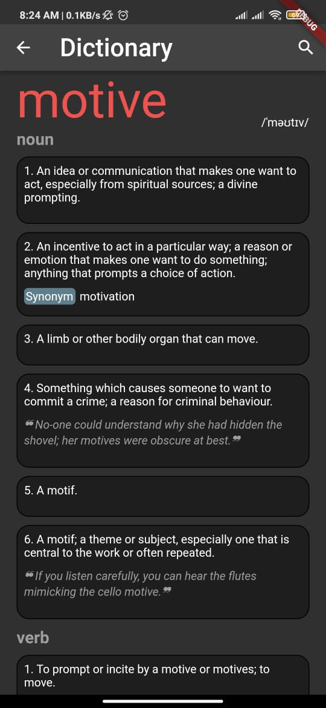

# Dictionary App implementation using Flutter

<b>Under production</b>

# Context

Flutter application that uses dictionary API to get meaning, examples, synonyms and antonyms of a word on the basis of part of speech they are to be expected in.

<label tx></label>

